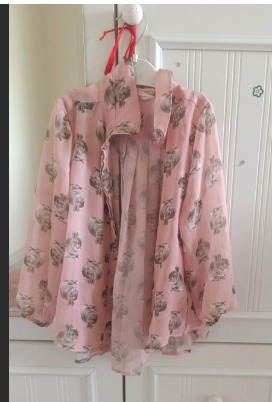
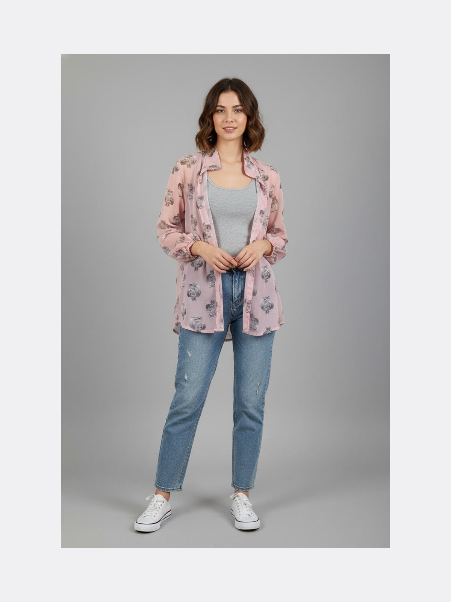
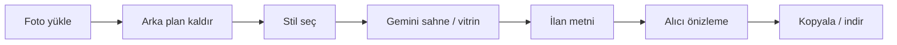

<p align="center">
  
</p>

<h1 align="center">Rafla</h1>

<p align="center">
  <strong>Telefon fotoğrafından vitrin kalitesi ve hazır ilan metni.</strong><br />
  Türkiye’de ikinci el moda satıcıları için yapay zeka destekli stüdyo.
</p>

<p align="center">
  <a href="https://github.com/omersemihuzun/Rafla"></a>
  <a href="https://www.typescriptlang.org/"></a>
  <a href="https://ai.google.dev/"></a>
  <a href="https://www.prisma.io/"></a>
  
</p>

---

## Neden Rafla?

İkinci elde alıcı **fotoğrafa ve güvene** bakar. Çoğu ilan yatak üstü çekim, dağınık arka plan ve “temiz sorunsuz” gibi kopyala-yapıştır metinle kalır.

**Rafla** ham telefon fotoğrafını alır; arka planı temizler, vitrin stilleri uygular, Gemini ile ürünü analiz eder ve **yapıştırmaya hazır ilan metni** üretir — Photoshop ve uzun açıklama yazmadan.

> Marketplace API’si yok: gerçek entegrasyon yerine **satıcı stüdyosu + export** modeli (hackathon ve MVP için güvenli).

---

## Öne çıkanlar

| Özellik | Açıklama |
|--------|----------|
| **Arka plan kaldırma** | rembg ile ücretsiz haklar; anında önce / sonra |
| **Vitrin stilleri** | Beyaz fon, askıda, ayna selfie, manken (Gemini görsel) |
| **Ürün analizi** | Kategori, renk, kusur, eksik alan uyarıları |
| **İlan paketi** | Tek akışta başlık + madde madde açıklama (TR) |
| **Alıcı gözü** | Yayınlamadan önce persona geri bildirimi |
| **Freemium kredi** | 3 arka plan + 3 sahne (demo); geliştirmede yenileme |

<p align="center">
  
  &nbsp;→&nbsp;
  
</p>

<p align="center"><em>Örnek: ham çekim → vitrin çıktısı (landing hero)</em></p>

---

## Akış (60 saniyede anlatılabilir)



1. **Yükle** — sürükle-bırak veya örnek fotoğrafla dene  
2. **Stüdyo** — kıyafet tipi + stil (beyaz / askıda / ayna / manken)  
3. **İlan paketi** — analiz + metin üret  
4. **Export** — metni kopyala, görseli indir  

---

## Hızlı başlangıç

### Gereksinimler

- **Node.js** 18+
- **Python** 3.10+ (arka plan servisi için, önerilir)
- **[Google AI Studio](https://aistudio.google.com/apikey)** API anahtarı

### 1. Kurulum

```bash
git clone https://github.com/omersemihuzun/Rafla.git
cd Rafla
npm install
cp .env.example .env
```

`.env` içine `GEMINI_API_KEY` ekle.

### 2. Veritabanı

```bash
npm run db:push
```

### 3. Arka plan servisi (önerilir)

```powershell
npm run setup:backend
npm run dev:backend
```

Ayrı terminalde:

```bash
npm run dev
```

→ **http://localhost:3000**

### 4. (Opsiyonel) Örnek görseller

```bash
npm run samples:fetch
```

---

## Ortam değişkenleri

| Değişken | Zorunlu | Açıklama |
|----------|---------|----------|
| `DATABASE_URL` | Evet | SQLite yolu (`file:./prisma/dev.db`) |
| `GEMINI_API_KEY` | Evet | Metin + görsel üretim |
| `GEMINI_MODEL` | Hayır | Varsayılan: `gemini-2.5-flash` |
| `GEMINI_IMAGE_MODEL` | Hayır | Manken / ayna için görsel model |
| `REMBG_SERVICE_URL` | Hayır | Varsayılan: `http://localhost:8000` |
| `NEXT_PUBLIC_APP_URL` | Hayır | Uygulama kök URL |

Tam liste: [`.env.example`](.env.example)

---

## Komutlar

| Komut | Ne yapar |
|-------|----------|
| `npm run dev` | Next.js geliştirme sunucusu |
| `npm run dev:backend` | rembg FastAPI (`:8000`) |
| `npm run setup:backend` | Python venv + bağımlılıklar |
| `npm run build` | Production build |
| `npm run db:push` | Prisma şema → SQLite |
| `npm run db:studio` | Prisma Studio |
| `npm run samples:fetch` | Demo görselleri indir |

---

## Mimari

```
Rafla/
├── src/app/              # Next.js App Router (landing, stüdyo, pricing)
├── src/app/api/          # REST API (upload, scene, copy, persona…)
├── src/components/       # UI bileşenleri
├── src/lib/              # Gemini, sahne, kredi, storage
├── backend/              # FastAPI + rembg
├── prisma/               # Şema (SQLite)
└── public/               # Statik görseller, uploads
```

**Stack:** Next.js 15 · React 19 · TypeScript · Prisma · Gemini API · rembg · Sharp

### API özeti

| Endpoint | Açıklama |
|----------|----------|
| `POST /api/upload` | Görsel yükle, listing oluştur |
| `POST /api/listings/[id]/remove-bg` | Arka plan kaldır |
| `POST /api/listings/[id]/generate-scene` | Vitrin stili (beyaz, askıda, ayna, manken) |
| `POST /api/listings/[id]/analyze` | Vision analiz |
| `POST /api/listings/[id]/generate-copy` | İlan metni |
| `POST /api/listings/[id]/persona-review` | Alıcı önizlemesi |
| `GET /api/me` | Kredi durumu |

---

## Geliştirme notları

**Internal Server Error / `Cannot find module './xxx.js'`**  
Eski `.next` önbelleği veya birden fazla `npm run dev` süreci. Çözüm:

```powershell
# Tüm dev sunucularını kapat (Ctrl+C)
Remove-Item -Recurse -Force .next
npm run dev
```

**`prisma/prisma/dev.db` commit etme** — yerel veritabanı `.gitignore` içinde.

**Hackathon demosu:** Canlı API kotası için 1 ürünü önceden işleyip yedek görsel + metin tutun.

---

## Ekip & katkı

| | |
|---|---|
| **Ürün** | Rafla — BTK Hackathon 2026 |
| **Repo** | [github.com/omersemihuzun/Rafla](https://github.com/omersemihuzun/Rafla) |

Pull request’ler `integrate/premium-ui-main` veya `main` üzerinden açılabilir. Büyük UI değişikliklerinde stüdyo sayfasını birlikte test edin.

---

## Lisans

[MIT](LICENSE) — hackathon ve demo kullanımı için özgürce fork edebilirsiniz.

---

<p align="center">
  <sub>Rafla · Seçkin ikinci el satıcıları için vitrin stüdyosu</sub>
</p>
